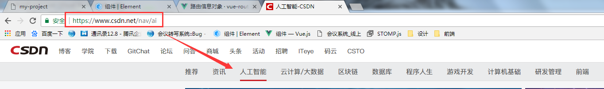

## ElementUI使用中遇到的问题

1. Vue 导航组件高亮的问题？   
原理：根据 URL 匹配菜单项

vue + vue-router + elementUI
```
<el-menu :router="true" :default-active="activeIndex">
    <el-menu-item index="/">首页</el-menu-item>
    <el-menu-item index="/page2"><a>订单管理</a></el-menu-item>
</el-menu>
data: function(){
    return {
        // 根据路由动态设置，当前激活菜单的 index
        activeIndex: this.$route.path
    }
}
```